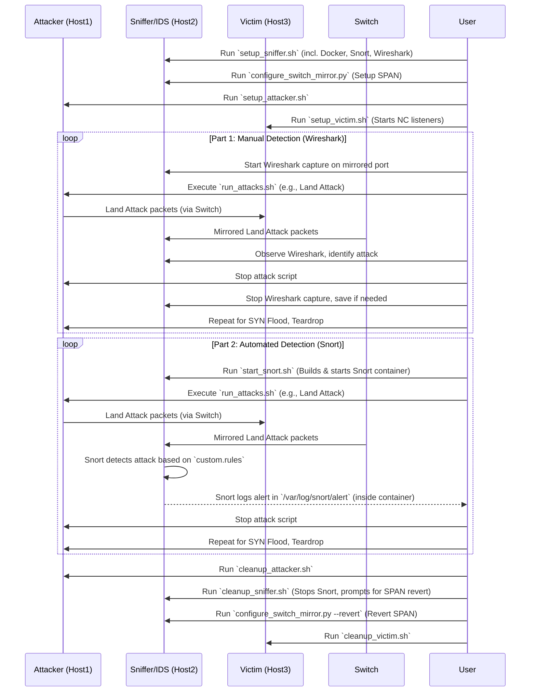

# DoS Attack Simulation Lab

This project provides a suite of scripts to set up a three-host environment for simulating and detecting Denial of Service (DoS) attacks. The lab is designed to be run on Ubuntu 22.04/24.04 LTS for the Attacker and Sniffer hosts.

## Lab Overview

The lab consists of three virtual or physical machines:
1.  **Host1: Attacker**: Launches DoS attacks (Land, TCP SYN Flood, Teardrop).
2.  **Host2: Sniffer/IDS**: Monitors network traffic using Wireshark and Snort (running in Docker).
3.  **Host3: Victim**: The target of the DoS attacks.

The simulation is divided into two main parts:
*   **Part 1: Manual Attack Detection**: Use Wireshark on the Sniffer host to observe and manually identify the characteristics of each DoS attack.
*   **Part 2: Automated Attack Detection**: Use Snort on the Sniffer host to automatically detect the DoS attacks based on predefined rules.

### Lab Architecture

```mermaid
graph TD
    subgraph "Network Infrastructure"
        SW[Managed Switch]
    end

    subgraph "Hosts"
        H1[Host1: Attacker<br>IP: 192.168.1.101]
        H2[Host2: Sniffer/IDS<br>IP: 192.168.1.102<br>Wireshark, Snort (Docker)]
        H3[Host3: Victim<br>IP: 192.168.1.103]
    end

    H1 -- "Traffic to Victim" --> SW
    H3 -- "Traffic from Attacker" --> SW
    SW -- "Port Mirroring (SPAN)" --> H2_SniffPort((Sniffer Port))
    
    H2 --- H2_SniffPort

    subgraph "Switch Configuration (via Host2)"
        H2_Serial[Serial Console on Host2]
        SW_Console[Switch Console Port]
        H2_Serial -.-> SW_Console
    end

    classDef host fill:#f9f,stroke:#333,stroke-width:2px;
    classDef switch fill:#ccf,stroke:#333,stroke-width:2px;
    class H1,H2,H3 host;
    class SW switch;
```

### Lab Workflow



## Prerequisites

1.  **Three Hosts**: Prepare three machines (VMs or physical) that can communicate with each other. Let's assume their IP addresses will be:
    *   Attacker (Host1): e.g., `192.168.1.101`
    *   Sniffer (Host2): e.g., `192.168.1.102` (This is the machine where these scripts are cloned and run from primarily)
    *   Victim (Host3): e.g., `192.168.1.103`
2.  **Network Connectivity**: Ensure all hosts are on the same network segment or can route to each other.
3.  **Switch with Port Mirroring (SPAN)**: A managed switch capable of port mirroring is required to send copies of network traffic from the Attacker and Victim ports to the Sniffer port.
4.  **Serial Connection to Switch**: For automated SPAN configuration, Host2 (Sniffer) needs a serial connection to the switch's console port.
5.  **Sudo Privileges**: All scripts must be run with `sudo` privileges.
6.  **Clone Repository**: Clone this repository onto Host2 (Sniffer). The Attacker and Victim setup scripts will need to be copied to their respective hosts.

## I. Environment Setup

**Important**: Execute all setup scripts with `sudo`.

### 1. Common Host Setup (All Hosts)

For each host (Attacker, Sniffer, Victim), you need to run a setup script. The primary script is `common/setup_host.sh`. This script will:
*   Backup existing Netplan configuration.
*   Set a static IP address (you will be prompted).
*   Update package lists.
*   Install essential tools (`python3-pip`, `net-tools`, `git`, `ufw`).

**Example for one host (repeat for all three, adjusting IPs):**
```bash
# On Host1 (Attacker)
sudo ./common/setup_host.sh 192.168.1.101 255.255.255.0 192.168.1.1

# On Host2 (Sniffer)
sudo ./common/setup_host.sh 192.168.1.102 255.255.255.0 192.168.1.1

# On Host3 (Victim)
sudo ./common/setup_host.sh 192.168.1.103 255.255.255.0 192.168.1.1
```
*Replace IP addresses, netmask, and gateway with your actual network configuration.*

### 2. Specific Host Setups

After the common setup, run the specific setup scripts on each host.

**a. Host1 (Attacker):**
Copy the `attacker` and `common` directories to Host1.
```bash
# On Host1 (Attacker)
sudo ./attacker/setup_attacker.sh 192.168.1.101 255.255.255.0 192.168.1.1
```
This script will:
*   Call `common/setup_host.sh`.
*   Install attack tools: Scapy, hping3, build-essential.
*   Configure UFW (default deny incoming, allow outgoing).

**b. Host2 (Sniffer/IDS - Current Machine):**
This machine should already have the repository cloned.
```bash
# On Host2 (Sniffer)
sudo ./sniffer/setup_sniffer.sh 192.168.1.102 255.255.255.0 192.168.1.1 <sniffer_interface_name>
```
*Replace `<sniffer_interface_name>` with the actual network interface on Host2 that will be connected to the switch's SPAN destination port (e.g., `eth1`).*
This script will:
*   Call `common/setup_host.sh`.
*   Install Docker, Docker Compose, Wireshark, and `pyserial`.
*   Add the current user to the `docker` group (you may need to log out and log back in for this to take effect).
*   Configure UFW to allow SSH and a Snort management port (TCP/8080, if you plan to use a web interface for Snort later).

**c. Host3 (Victim):**
Copy the `victim` and `common` directories to Host3.
```bash
# On Host3 (Victim)
sudo ./victim/setup_victim.sh 192.168.1.103 255.255.255.0 192.168.1.1
```
This script will:
*   Call `common/setup_host.sh`.
*   Install `tcpdump` and `netcat-openbsd`.
*   Configure UFW to allow traffic on ports used by the attacks (TCP/139 for Land, TCP/80 for SYN Flood).
*   Start `netcat` listeners on these ports to simulate services.

### 3. Configure Switch Port Mirroring (SPAN)

On Host2 (Sniffer), run the `configure_switch_mirror.py` script. This script automates the configuration of a Cisco switch for port mirroring via its serial COM port.

**Before running:**
*   Ensure Host2 has a physical serial connection to your Cisco switch's console port.
*   Identify the serial port device name on Host2 (e.g., `/dev/ttyUSB0`, `/dev/ttyS0`).
*   Know the switch interface connected to Host1 (Attacker), Host3 (Victim), and Host2 (Sniffer's monitoring interface).

```bash
# On Host2 (Sniffer)
sudo python3 ./sniffer/configure_switch_mirror.py \
    --port /dev/ttyUSB0 \
    --username <switch_username> \
    --password <switch_password> \
    --enable_password <switch_enable_password> \
    --source_ports Gi1/0/1,Gi1/0/2 \
    --destination_port Gi1/0/3
```
*   Replace placeholders with your switch's credentials, serial port, and interface names.
*   `--source_ports`: Comma-separated list of switch ports connected to Attacker and Victim.
*   `--destination_port`: Switch port connected to Sniffer's monitoring interface.

If automated configuration is not possible, configure SPAN manually on your switch. The goal is to mirror traffic from the Attacker and Victim ports to the Sniffer port.

## II. Part 1: Manual Attack Detection with Wireshark

1.  **Start Wireshark on Host2 (Sniffer):**
    ```bash
    # On Host2 (Sniffer)
    sudo wireshark
    ```
    *   Select the network interface connected to the switch's SPAN destination port.
    *   Start capturing traffic.

2.  **Launch Attacks from Host1 (Attacker):**
    On Host1, use the `run_attacks.sh` script.
    ```bash
    # On Host1 (Attacker)
    cd attacker # or the directory where run_attacks.sh is located
    sudo ./run_attacks.sh <victim_ip>
    ```
    *   Replace `<victim_ip>` with the IP address of Host3 (e.g., `192.168.1.103`).
    *   The script will prompt you to select which attacks to run (Land, SYN Flood, Teardrop) and ask for specific parameters (ports, packet counts).

3.  **Observe in Wireshark:**
    *   Analyze the captured traffic in Wireshark on Host2.
    *   Look for the characteristic patterns of each attack:
        *   **Land Attack**: SYN packets where source IP/port are the same as destination IP/port.
        *   **TCP SYN Flood**: A high volume of SYN packets from various (often spoofed) source IPs to a specific port on the victim, with no corresponding ACKs from the victim for many of them.
        *   **Teardrop Attack**: IP fragments with overlapping offsets.

## III. Part 2: Automated Attack Detection with Snort

1.  **Start Snort on Host2 (Sniffer):**
    The `setup_sniffer.sh` script should have installed Docker and Docker Compose. The Snort configuration is in `sniffer/snort_config` and rules in `sniffer/rules`.
    Ensure the `INTERFACE` variable in `sniffer/docker-compose.yml` is set to your sniffer interface.
    ```yaml
    # sniffer/docker-compose.yml excerpt
    # ...
    environment:
      - INTERFACE=eth1 # <-- Make sure this is your sniffing interface
    # ...
    ```
    Then, start Snort:
    ```bash
    # On Host2 (Sniffer)
    cd sniffer # or the directory where start_snort.sh is located
    sudo ./start_snort.sh
    ```
    This script runs `docker-compose up --build -d` to build and start the Snort container in detached mode. Logs will be in `sniffer/snort_logs/`.

2.  **Launch Attacks from Host1 (Attacker):**
    Repeat the same steps as in Part 1 (Step 2) to launch attacks using `run_attacks.sh` from Host1.

3.  **Check Snort Alerts:**
    Monitor Snort's output and logs for alerts.
    *   **Live Alerts (Console):** If Snort is configured for console output (default in `snort.lua` is `alert_fast`).
        ```bash
        # On Host2 (Sniffer)
        sudo docker logs -f snort3 # (snort3 is the service name in docker-compose.yml)
        ```
    *   **Log Files:** Check the `alert_full` or `alert_fast` files in `sniffer/snort_logs/` (or as configured in your `snort.lua`). The `custom.rules` file contains rules to detect these specific attacks.

## IV. Environment Cleanup

After completing the simulations, run the cleanup scripts on each host to revert changes.

**Important**: Execute all cleanup scripts with `sudo`.

1.  **Host1 (Attacker):**
    ```bash
    # On Host1 (Attacker)
    sudo ./attacker/cleanup_attacker.sh 192.168.1.101
    ```
    *   This calls `common/cleanup_host.sh` which attempts to restore the original Netplan configuration and remove UFW rules.

2.  **Host2 (Sniffer/IDS):**
    ```bash
    # On Host2 (Sniffer)
    sudo ./sniffer/cleanup_sniffer.sh 192.168.1.102
    ```
    This script will:
    *   Call `common/cleanup_host.sh`.
    *   Stop and remove the Snort Docker container and image.
    *   **Revert Switch Port Mirroring**: *Currently, this script does not automatically revert switch SPAN configuration. You will need to manually remove the SPAN session from your Cisco switch or extend `cleanup_sniffer.sh` and `configure_switch_mirror.py` to support this.* Example manual Cisco commands:
        ```
        configure terminal
        no monitor session 1
        end
        ```

3.  **Host3 (Victim):**
    ```bash
    # On Host3 (Victim)
    sudo ./victim/cleanup_victim.sh 192.168.1.103
    ```
    *   This calls `common/cleanup_host.sh` and stops the `netcat` listeners.

### General Cleanup Notes:
*   The `common/cleanup_host.sh` script attempts to restore the Netplan configuration from a backup. Review network settings post-cleanup.
*   Package removal is generally not performed by the cleanup scripts to avoid accidental uninstallation of needed tools. You can manually uninstall packages if desired.

## Customization

*   **Snort Rules**: Modify `sniffer/rules/custom.rules` to add or refine detection rules.
*   **Snort Configuration**: Adjust `sniffer/snort_config/snort.lua` for different logging, output, or preprocessor settings. Remember to update `HOME_NET` to your actual network range.
*   **Attack Scripts**: The Python attack scripts in the `attacker/` directory can be modified to change attack parameters or behavior.

This lab provides a foundation for understanding DoS attacks and IDS/IPS mechanisms. Experiment with different attack variations and Snort configurations to deepen your knowledge.
